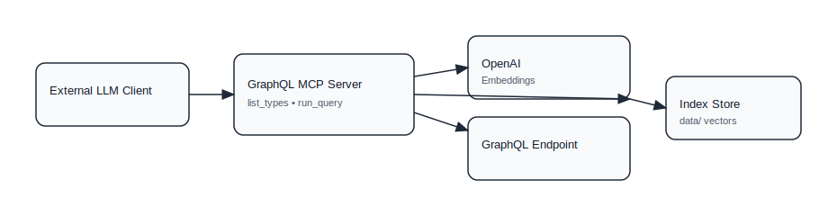

# GraphQL schema embedder MCP server

Dockerized Python MCP server for LLMs that indexes a GraphQL schema, stores OpenAI embeddings per `type->field`, and enables fast lookup plus `run_query` execution once relevant types are identified to fetch data from your GraphQL endpoint.

## Architecture
- GraphQL schema: `schema.graphql` is a small e-commerce example to exercise parsing and indexing.
- Indexer: `schema_indexer.py` flattens the schema into `type.field` signatures (with arguments and return types), embeds each summary via OpenAI, and persists to `data/metadata.json` + `data/vectors.npz` (normalized embeddings for cosine search).
- Server: `server.py` exposes MCP tools `list_types` and `run_query`. The server ensures the schema index exists on startup; it only touches OpenAI when reindexing or embedding a new query.
- Persistence: `data/` is `.gitignore`'d so you can regenerate locally without polluting the repo.



## Setup
1st create a `.env` file with `OPENAI_API_KEY`.
```bash
cd mcp
python3 -m venv .venv
source .venv/bin/activate
pip install -r requirements.txt
export OPENAI_API_KEY=...  # required for indexing and querying
```

## Docker
From `mcp/`:
```bash
docker compose up --build
```
The MCP server will be available at `http://127.0.0.1:8000/sse`.
Set `OPENAI_API_KEY` in `mcp/.env` if you plan to use `list_types`.

To run against the bundled test endpoint:
```bash
GRAPHQL_ENDPOINT_URL=http://graphql-test:4000/graphql docker compose up --build
```

To run only one service:
```bash
docker compose up --build graphql-mcp
docker compose up --build graphql-test
```

## Index the schema
```bash
python3 schema_indexer.py  # uses schema.graphql and data/ by default
```
Outputs a count plus schema hash; rerun after editing the schema.

## Search via CLI (no server)
```bash
python3 schema_indexer.py search "find order mutations"
python3 schema_indexer.py search "product price fields" --limit 3
```
Search auto-builds the index if missing.

## Run the MCP server
```bash
python3 server.py                     # SSE on 127.0.0.1:8000/sse by default
python3 server.py --transport sse     # explicit SSE
python3 server.py --transport streamable-http  # Streamable HTTP on 127.0.0.1:8000/mcp
# Optional: choose a different schema file
python3 server.py --schema /path/to/schema.graphql
# Or: point at a live GraphQL endpoint (requires introspection enabled)
python3 server.py --endpoint https://api.example.com/graphql
# Endpoint auth headers (repeat --header)
python3 server.py --endpoint https://api.example.com/graphql --header "Authorization: Bearer $TOKEN"
# Options: --host 0.0.0.0 --port 9000 --log-level DEBUG --mount-path /myapp
```
Tools:
- `list_types(query, limit=5)` – fuzzy search over `type.field` signatures (embeddings; auto-build index if missing). Results are ordered with `Query` fields first and include a `query_template` for `Query` fields plus a `selection_hint` for object fields.
- `run_query(query)` – if `--endpoint` is set, proxies the query to the endpoint; otherwise validates/runs against the local schema (no resolvers; primarily for validation/shape checking, data resolves to null).
Both indexing and querying use the same embedding model (`text-embedding-3-small` by default).

Example `list_types` output:
```json
[
  {
    "type": "Query",
    "field": "users",
    "summary": "Query.users(limit: Int = 10, offset: Int = 0) -> [User!]!",
    "query_template": "query { users(limit: <Int = 10>, offset: <Int = 0>) { id name email profile { joinedAt preferences { newsletter } } orders { id status total } } }"
  },
  {
    "type": "User",
    "field": "orders",
    "summary": "User.orders -> [Order!]!",
    "selection_hint": "orders { id status total items { quantity subtotal } }"
  },
  {
    "type": "Product",
    "field": "reviews",
    "summary": "Product.reviews -> [Review!]!",
    "selection_hint": "reviews { id rating title author { id name } }"
  }
]
```

Notes:
- `python3 server.py` defaults to the `sse` transport; pass `--transport streamable-http` if you want HTTP instead.
- You can also set env vars prefixed with `FASTMCP_` (e.g., `FASTMCP_HOST`, `FASTMCP_PORT`, `FASTMCP_LOG_LEVEL`) to override defaults.
- The server exposes MCP `instructions` (override with `MCP_INSTRUCTIONS`) that describe the server as an abstraction layer and tell the LLM to use `list_types` then `run_query` with minimal tool calls.

## Quick test with the MCP Inspector
Requires `npm`/`npx` on PATH.

### Connect to an already-running SSE server
In one terminal (start the server):
```bash
python3 server.py --transport sse --port 8000
```
In another terminal (start the Inspector and point it at `/sse`):
```bash
npx @modelcontextprotocol/inspector --transport sse --server-url http://127.0.0.1:8000/sse
```

## Local endpoint for testing `--endpoint`
This repo includes a tiny GraphQL HTTP server with real resolvers at `test_graphql_server/`.

In one terminal:
```bash
python3 test_graphql_server/server.py --port 4000
```

Then run this MCP server against it:
```bash
python3 server.py --endpoint http://127.0.0.1:4000/graphql
```

`run_query` will return real data from the endpoint. `list_types` still needs `OPENAI_API_KEY` to build/search the embedding index.

## Configure in Claude Desktop / CLI
If you're running this server locally over SSE (default), point Claude at the `/sse` URL.

```bash
# Add a local-scoped server (default)
claude mcp add --transport sse graphql-mcp http://127.0.0.1:8000/sse
```

You can also configure via JSON (e.g. config file):
```json
{
  "mcpServers": {
    "graphql-mcp": {
      "type": "sse",
      "url": "http://127.0.0.1:8000/sse"
    }
  }
}
```

If you expose this server behind auth, pass headers:
```bash
claude mcp add --transport sse private-graphql http://127.0.0.1:8000/sse \
  --header "Authorization: Bearer your-token-here"
```
